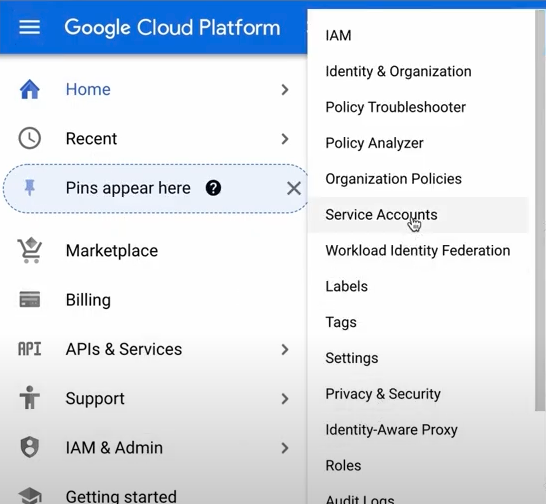
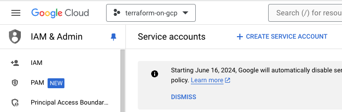
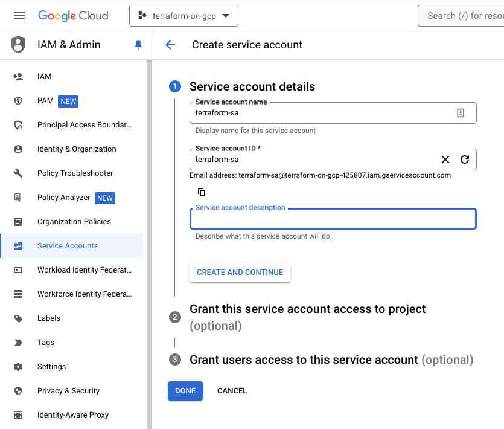
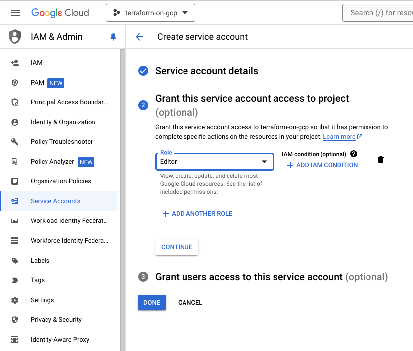
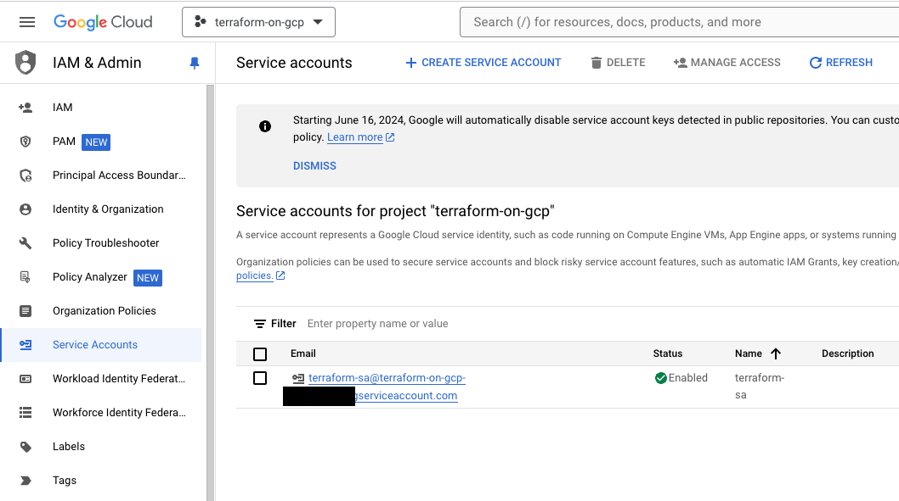
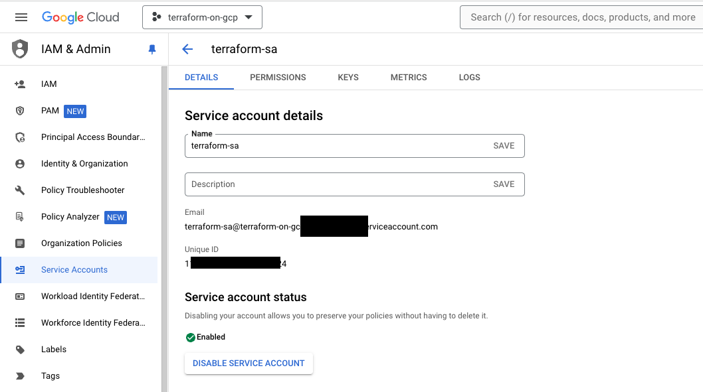
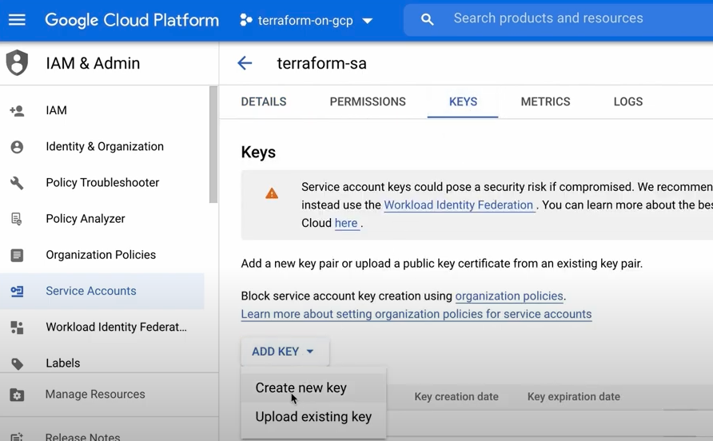
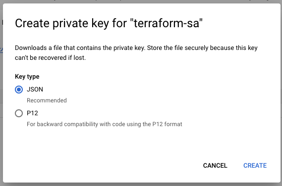
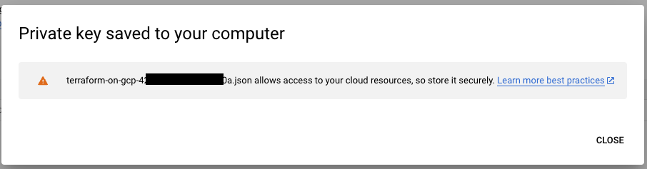

# Service Account Creation on GCP

To manage this project via terraform, a service credential is needed.

1) From the project menu, select `IAM & Admin` > `Service Accounts`

2) Click `Create Service Account`

3) Fill in the `Service account name` field and click `Create and Continue`

4) Give the Service Account an `Editor` role to allow access to all the resources. Afterwards, Click `Continue`.

5) Click `Done`. From here, you should see that the Service Account is created.

6) From here, we need to create a key. Select the created Service Account.

7) Switch to `Keys` tab > `Add Key` > `Create new key`

8) Select `JSON` then click `Create`.

9) It will download the private key into your local machine. Make sure to keep it in a safe location.

