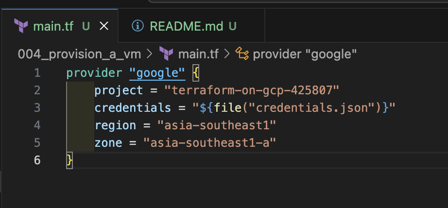
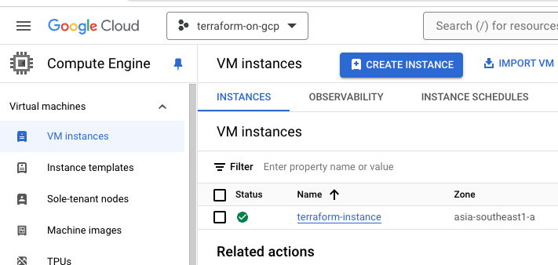

# Provisioning a VM

1) Make sure to have a private key from the service_account_creation step.

2) Create a main.tf file.



```
provider "google" {
    project = "terraform-on-gcp-425807"
    credentials = "${file("credentials.json")}"
    region = "asia-southeast1"
    zone = "asia-southeast1-a"
}
```

3) Run the following command in the same directory as `main.tf` file.

```shell
terraform init
```

Result:
```shell
Initializing the backend...

Initializing provider plugins...
- Finding latest version of hashicorp/google...
- Installing hashicorp/google v5.32.0...
- Installed hashicorp/google v5.32.0 (signed by HashiCorp)

Terraform has created a lock file .terraform.lock.hcl to record the provider
selections it made above. Include this file in your version control repository
so that Terraform can guarantee to make the same selections by default when
you run "terraform init" in the future.

Terraform has been successfully initialized!

You may now begin working with Terraform. Try running "terraform plan" to see
any changes that are required for your infrastructure. All Terraform commands
should now work.

If you ever set or change modules or backend configuration for Terraform,
rerun this command to reinitialize your working directory. If you forget, other
commands will detect it and remind you to do so if necessary.
```

4) Update `main.tf` file to define the resource to create.

```
resource "google_compute_instance" "my_instance" {
    name = "terraform-instance"
    machine_type = "e2-micro"
    zone = "asia-southeast1-a"
    allow_stopping_for_update = true

    boot_disk {
        initialize_params {
            image = "debian-cloud/debian-12"
        }
    }

    network_interface {
        network = "default"
        access_config {
            // Ephemeral IP
        }
    }
}
```

5) Run the command below to see the resources that will be created:

```shell
terraform plan
```

6) Execute the command below to create the resources.

```shell
terraform apply
```

It will ask for a verification. Type `yes` to confirm this action.

If successful, you should see the resource created in the console:



Note that there might be some issues such as:
- **image not found (debian-cloud/debian-12):** in this case, execute this command to get a list of available images: `gcloud compute images list`
- **Error 403: Compute Engine API has not been used in project:** you will need to enable the Compute Engine API in the console. The logs should provide a link that you can just access.
- **A f1-micro VM instance is currently unavailable in the asia-southeast1-a zone:** For this issue, check the list of available VM types on the portal